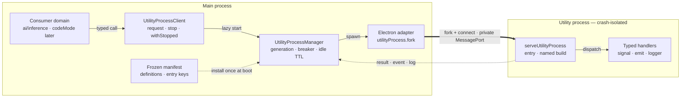

# RFC: `core/utilityProcess` V1 — generic utility-process layer

- **Issue:** [#19621](https://github.com/CherryHQ/cherry-studio/issues/19621) (Phase 0: design agreement)
- **Status:** Draft for detailed review. E1/E2 are complete; [§9](#9-experiment-results-2026-08-28)
  records the remote evidence. E1 rejected `?modulePath` on the pinned toolchain and selected the
  dedicated named-entry build in §7; E2 confirmed app-level proxy inheritance.
- **Deliverable of V1:** the generic layer only. No consumer migrates in V1; the production
  manifest ships empty and existing behavior is unchanged.

---

## 1. Scope

V1 delivers `src/main/core/utilityProcess/`: a manager, a typed client, a child-side runtime
helper, one wire protocol, and the failure/circuit policy — everything the three existing ad-hoc
worker hosts each reinvented. It deliberately does **not** deliver:

- consumer migrations (local-model, codeMode, screenshot — later phases, own PRs);
- worker-thread backing (process-only; see §10);
- request queueing, concurrency limits, timeouts, retries, or backpressure (consumer-owned);
- worker-initiated RPC back into main (future, additive — codeMode's need);
- transfer lists / zero-copy payloads (structured clone only; Electron's utility-process
  transfer list accepts only `MessagePortMain` anyway);
- runtime validation of business payloads (envelope validation only — no Zod/oRPC);
- a security sandbox. A utility process is a **crash-isolation** boundary, nothing more.

Although no consumer migrates, the interface is shaped against a named first consumer:
local-model inference (embedding / OCR / speech), whose Windows DLL conflict is the forcing
constraint recorded in the issue. §8 contains a migration sketch validating the fit on paper.

## 2. Answers to the issue's open questions

1. **Threads too?** No — process-only. The two mechanisms don't share crash isolation,
   termination, metrics attribution, or memory-release semantics; a dual backend is either
   lowest-common-denominator or leaks backend checks into consumers. `windowEnumerator` (8 ms
   spawn on a capture path) simply stays a thread until its own migration proves otherwise.
   Note the repo already has a fourth, *file-entry* thread host — see §7.3 — which remains the
   sanctioned pattern for cheap short-lived thread work.
2. **How much protocol does core own?** Request/response correlation, typed events, cancellation
   delivery, readiness handshake, generation-safe settlement, structured log relay. Core does
   **not** own queueing, timeout semantics, pause/resume, or reverse RPC.
3. **Proxy?** Core does not depend on `ProxyService`. Networked children must use `electron.net`,
   which follows the app-level proxy because `ProxyService` already calls `app.setProxy()` —
   the API governing requests without an associated session, i.e. utility-process `net`. Node
   `fetch`/`http`/undici in a child is explicitly *not* promised to match main. E2 measured this
   exact `app.setProxy()` → child `electron.net.fetch()` path in development, production, and
   temporary-ASAR runs. Local-model needs none of this — its workers are proven offline — so its
   proxy plumbing is deleted, not migrated.
4. **Circuit breaker?** Three consecutive infrastructure failures open the circuit; recovery only
   via explicit consumer reset or app restart; no auto half-open. User-facing behavior is a
   documented **consumer recovery contract** (§5.3) — core never renders UI.
5. **Does this belong in `core/`?** Yes — same shape as `core/window/`: a registry-declared,
   lifecycle-managed owner of an OS resource with a narrow consumer API.
6. **Sequencing?** Local-model proxy-plumbing deletion is independent and can land anytime. E1 is
   complete; next: this subsystem → local-model migration plus production-build wiring → other
   consumers under own issues.

## 3. Public interface

Everything below is the *entire* exported seam. Not exported: `fork`, PID, `MessagePort`,
generation counters, start/restart/status. Consumers cannot observe process state except through
request outcomes — no state event surface until a consumer demonstrates the need.

```ts
type UtilityProcessMethod<Input, Output, Event = never> = {
  input: Input
  output: Output
  event: Event
}

type UtilityProcessDefinition<Contract, InitData = void> = Readonly<{
  id: string                       // unique lowercase namespaced identifier
  entry: string                    // lowercase build-manifest key; core resolves the emitted path
  cancellation: 'terminate' | 'cooperative'
  idleTimeoutMs?: number           // positive integer; absent = live until stop/app quit
  createEnv?: () => Readonly<Record<string, string>>   // per generation, additive only
  createInitData?: () => InitData                      // per generation, opaque to core
}>

interface UtilityProcessClient<Contract> {
  request<M extends keyof Contract['methods']>(
    method: M,
    input: Contract['methods'][M]['input'],
    options?: {
      signal?: AbortSignal
      onEvent?: (event: Contract['methods'][M]['event']) => void
    }
  ): Promise<Contract['methods'][M]['output']>

  stop(options?: { resetFailures?: boolean }): Promise<void>

  withStopped<T>(
    operation: () => T | Promise<T>,
    options?: { resetFailures?: boolean }
  ): Promise<T>
}
```

- `defineUtilityProcess()` builds a frozen definition; `serveUtilityProcess()` is the child-side
  runtime (§3.2); a single `UtilityProcessError` class carries a stable `code` (§5.4).
- `manager.client(definition)` returns a cached stable client keyed by definition **object
  identity** and does not spawn. The first `request()` lazily starts the process; concurrent
  requests during one cold start share a single startup barrier.
- Composition: business domains export typed definitions + entries;
  `core/application/utilityProcessManifest.ts` aggregates them into a frozen manifest, installed
  **once** in `main.ts` before `application.registerAll()`. Installation validates ID format and
  uniqueness, entry-key format, cancellation value, and positive `idleTimeoutMs`; `client()`
  accepts only the identical definition object from the installed manifest — no runtime
  registration of arbitrary entries. `UtilityProcessManager` registers as a `Phase.WhenReady`
  lifecycle service (`utilityProcess.fork()` requires app ready).
- `serviceName` is derived, never declared: `CherryStudio.UtilityProcess.<id>` — the stable
  correlation key in `app.getAppMetrics()` and `child-process-gone`.

### 3.1 Contract typing

Method maps are TypeScript-only. Main and child come from the same signed build, so they are not
a trust boundary; a global protocol version in the handshake detects mixed-build skew, which
runtime business schemas could not fix anyway. Core validates its own envelope with small
hand-written type guards — no schema library enters the dependency graph.

### 3.2 Child entry

```ts
serveUtilityProcess<Contract>({
  id,
  initialize?,   // (initData, { logger }) — wiring only; ready is sent after it completes
  handlers,      // per-method: (input, { signal, emit, logger }) => output
  dispose?       // ({ logger }) — graceful-shutdown hook
})
```

Business code implements handlers; ports, envelopes, error serialization, AbortControllers, and
shutdown ordering are hidden. **`initialize` must stay light** (paths, bindings wiring): the
spawn→ready deadline is a fixed 10 s with no per-definition override — heavy work (model loads)
belongs in handlers or an explicit warmup method, where it gets no artificial deadline and
consumer-owned cancellation. This is a documented hard convention, not a tunable.

## 4. Protocol and lifecycle

Data flow: `consumer → stable client → manager generation state → Electron adapter → private
MessagePort → serveUtilityProcess → typed handler`.



- Bootstrap: main sends exactly one `connect` over `process.parentPort`, transferring a private
  `MessagePortMain`; `parentPort` never carries business traffic afterward.
- Every frame carries `{ protocol, version, processId, generation, kind }`.
  main→child: `request` / `cancel` / `shutdown`. child→main: `ready` / `event` / `result` /
  `error` / `startup-error` / `log` / `protocol-error`.
- Unknown method, duplicate requestId or terminal, bad correlation, version/generation mismatch:
  **fatal protocol violation** — the generation is quarantined and terminated, every pending
  request settles exactly once, and the failure counts toward the breaker. Both sides come from
  one build; a protocol mismatch means a packaging or implementation defect, not input noise.
  Late events/results for an already-cancelled request are a normal race — dropped, not a
  violation.
- Payloads travel by structured clone, no transfer list. An unserializable *input* rejects only
  that request (`PROCESS_SERIALIZATION_FAILED`, local). An unserializable *result/event* is
  converted child-side into a clone-safe remote error terminal — it never crashes main.
- Exit truth: the wrapper's `exit` event is the only lifecycle fact and settles requests.
  `app.child-process-gone` (correlated by `serviceName`) only enriches diagnostics with
  Chromium's exit reason — it never drives state transitions and can never be attributed to a
  newer generation.
- No eager restart, no request replay, ever. An unexpected exit rejects in-flight requests; the
  *next* request lazily spawns a fresh generation (unless the circuit is open). An idle crash
  therefore cannot loop.
- `idleTimeoutMs` arms when the last pending request settles; any new request clears it. If idle
  stop has begun, a new request waits for the old generation's real exit, then respawns.

### 4.1 Cancellation

Declared per definition:

- **`cooperative`** — main rejects immediately with the caller's original `signal.reason` and
  sends `cancel`; the child aborts the handler's `signal` with a fixed internal AbortError. Both
  sides keep a tombstone until terminal/exit so late results are never delivered. Core
  deliberately does not wait for child acknowledgment: a handler that ignores its signal must
  not be able to wedge the caller — a definition needing that guarantee picks `terminate`.
- **`terminate`** — cancelling any request kills the whole generation. The cancelling caller
  gets its original reason after the real exit; other in-flight requests get an intentional
  `PROCESS_EXITED`; the exit does not count toward the breaker. This is the honest answer for
  long native calls that cannot be cooperatively interrupted.

`onEvent` callbacks run synchronously and in order, with no backpressure. A **throwing `onEvent`
callback cancels its request under the definition's cancellation policy and propagates the
original callback error** — swallowing consumer exceptions to keep a stream alive would be a
silent failure. Corollary, accepted: on a `terminate` definition an `onEvent` throw brings down
the generation.

### 4.2 `stop()` and `withStopped()`

- `stop()` is a short barrier: send `shutdown` (child aborts handlers, runs `dispose`, closes the
  port), call `kill()` after 1 s, wait at most 4 s total. Only an observed wrapper `exit` counts
  as success; timeout returns `PROCESS_STOP_FAILED`, the generation stays quarantined, and **no
  replacement spawns until the real exit is observed** — never two live generations for one id.
  `stop()` is idempotent (concurrent calls share one promise); new requests during a plain
  `stop()` wait for the barrier, then lazily respawn.
- `withStopped(operation)` is the maintenance gate (e.g. deleting model files on Windows, where
  the child must have released its file handles). From enqueue on, new requests **fail fast**
  with `PROCESS_BLOCKED` (documented as retriable) — queueing them would entangle "delete waits
  for requests" with "requests wait for delete" under an unbounded operation. The operation runs
  only after a confirmed exit; concurrent `withStopped()` calls serialize; an operation throw
  releases the gate but keeps the process stopped and propagates the original error.
- The 4 s stop ceiling fits inside the lifecycle framework's 5 s per-service stop budget;
  manager shutdown stops all generations in parallel.

## 5. Failure accounting and the circuit breaker

### 5.1 What counts

One failure per generation: spawn failure, ready-handshake timeout, `createEnv` /
`createInitData` / `initialize` throw, fatal protocol violation, abnormal exit. These are the
deterministic-crash shapes (bad path, missing native binding, broken packaging) the breaker
exists to stop from respawn-looping.

### 5.2 What clears and what opens

Any well-formed terminal response — **including a handler error** — proves spawn, handshake, and
dispatch all work, and resets the consecutive-failure count to zero. Business bugs must not
consume the infrastructure failure budget (`ready` alone is too early to prove dispatch).

The third consecutive failure still returns the *real* root cause, annotated
`{ failureCount: 3, circuitOpen: true }`. From then on requests fail fast with
`PROCESS_CIRCUIT_OPEN` and nothing spawns. Recovery: a **successful** explicit reset
(`stop({ resetFailures: true })`, or `withStopped(op, { resetFailures: true })` where the reset
applies only if `op` succeeds — a failed remediation must not manufacture a retry), or app
restart. No automatic half-open: a deterministic crasher gets no free retries, and transient
causes get a deliberate, consumer-visible retry affordance instead of a hidden timer.

### 5.3 Consumer recovery contract

Mechanism without product semantics is how three hosts diverged in the first place, so the
contract ships in the module README as normative:

> On `PROCESS_CIRCUIT_OPEN`, the consumer must surface its capability as **unavailable** and
> offer an explicit retry affordance; retry means `stop({ resetFailures: true })` (or a
> `withStopped` remediation) followed by a normal request. Core never shows UI, never toasts,
> never auto-recovers.

### 5.4 Error model

One exported `UtilityProcessError` with a stable `code`:
`PROCESS_START_FAILED`, `PROCESS_EXITED`, `PROCESS_PROTOCOL_ERROR`, `PROCESS_REMOTE_ERROR`,
`PROCESS_SERIALIZATION_FAILED`, `PROCESS_BLOCKED`, `PROCESS_CIRCUIT_OPEN`,
`PROCESS_STOP_FAILED` — plus `processId` and optional generation/exit metadata. Remote handler
errors are rebuilt from `name` / `message` / `stack` and an optional string-or-number `code`;
arbitrary `cause`/`data` graphs and custom prototypes are not reconstructed. Cancellation
rethrows the caller's own `signal.reason` untouched. Expected business failures belong in
business result types, not in `PROCESS_REMOTE_ERROR`.

## 6. Environment, fork policy, and logging

- Fork options are fixed by core, not configurable: empty `args`/`execArgv`, `stdio: 'pipe'`,
  no `cwd` (all business paths must be absolute), `allowLoadingUnsignedLibraries` / `disclaim` /
  `respondToAuthRequestsFromMainProcess` all false.
- The environment is a **non-empty hermetic baseline** (an empty env would make Electron fall
  back to inheriting the full parent environment): `NODE_ENV`, `PATH`, locale/timezone, the
  platform loader / AppImage essentials, and a temp dir pointed at
  `application.getPath('app.temp')` (the repo's Cherry-scoped, auto-ensured temp — per
  `pathRegistry`'s own convention, not OS-wide `sys.temp`). Definitions may only **add**
  variables: no overriding the baseline, no `NODE_*` / `ELECTRON_*` /
  `CHERRY_UTILITY_PROCESS_*`, no dynamic-library injection variables. `HOME`, profile dirs,
  proxy variables, and tokens are never passed by default.
- stdout→`debug`, stderr→`warn`, UTF-8-safe line decoding, 64 KiB per-line cap — the fallback
  channel for native libraries. First-class logging is the protocol's `log` frame: the
  `context.logger` shim in the child relays structured records that main stamps with process id,
  generation, PID, and requestId before routing into `loggerService`. Core never logs business
  payloads. (The child must not touch `loggerService` directly — see the lint boundary below;
  its `isMainThread` guard does not fire in a utility process, where `isMainThread === true`.)

## 7. Build, entries, and the import boundary

### 7.1 Entry mechanism

Entries are ordinary, typecheckable, lintable TypeScript modules. V1 does **not** use
electron-vite's `?modulePath`: E1 found two deterministic failures in that plugin on the pinned
electron-vite 5 / rolldown-vite 7.3 toolchain (§9).

Utility entries use a **dedicated utility build**, not extra inputs in the existing main build:

- a closed object manifest maps each definition's logical `entry` key to its TypeScript source;
- electron-vite receives that object as `build.lib.entry`, writes CJS to
  `out/utility-process/`, and uses `[name].js` for stable entry filenames;
- `preserveModules: true` (with a utility-source `preserveModulesRoot`) is mandatory. Without it,
  Rolldown made the child entry require and execute the main entry even though their source graphs
  were independent; `hoistTransitiveImports: false` did not remove that edge;
- the utility build reuses the main build's externalization predicate, but not its `manualChunks`
  or `chunkExportGuardPlugin`. It runs after the existing main build so neither build can erase the
  other's output.

The adapter resolves `entry` centrally through a new read-only Path Registry key,
`application.getPath('app.utility_process', `${entry}.js`)`, where `app.utility_process` is
`{app.root}/out/utility-process`. Consumers never construct a bundle path. The same resolution
works in development and inside `app.asar`, as E1 proved.

V1's production manifest is empty, so no production utility bundle or build-script change ships
yet. The smoke harness owns its dedicated fixture build. The first consumer PR adds the closed
entry manifest, production build step, and development watcher, then repeats the §9 proof against
the real package. Eval'd source strings and `Function.prototype.toString()` inlining remain
banned; the `nativeCaptureBackendPath()`-style workarounds they forced become deletable.

### 7.2 Entry import boundary (lint-enforced)

Nothing structural stops an entry (or its transitive imports) from pulling in main-only
singletons — `@application` would crash in the child (`app` is unavailable), and `@logger`
would *silently* construct a second winston writing the same files. So the boundary is
enforced, not documented: entries live under a dedicated directory/naming convention and an
`eslint` `no-restricted-imports` zone rule forbids `@logger`, `@application`, `@data`, and the
other main-only singletons inside them. Same discipline tier as the eval ban; part of the V1
deliverable.

### 7.3 Corrections to the issue's inventory

- `InferenceServiceBase` lives at `src/main/ai/inference/`, not `ai/localModel/runtime/`.
- There is a **fourth** worker host the issue misses, and it already disproves "every host is an
  eval'd string": `services/readableContent/ReadableContentService.ts` has imported a real file
  worker via `?nodeWorker` since #16893 and ships in releases. This is the production precedent
  that electron-vite file entries + packaging work in this repo, but it does not validate the
  separate `?modulePath` plugin that E1 rejected. It stays the reference pattern for cheap
  short-lived *thread* work that doesn't need process isolation.
- The "electron-vite builds main as a single bundle, so separate entries are impossible"
  comments in `inferenceWorkerSource.ts` and `windowEnumerator.ts` are stale relative to that
  precedent and should be corrected when those files are next touched.

### 7.4 Residual build risk (explicit)

E1 removed two assumptions from the original design:

1. `?modulePath` is not viable on the pinned toolchain: its nested lib build first defaulted to
   UMD/IIFE without a required name; forcing a single CJS format then hit electron-vite's own
   `undefined is not iterable` result-shape bug.
2. Named inputs cannot be added directly to the main build. With normal chunking, the emitted
   utility entry required `index.js` and executed `app.whenReady()` in the child. Making the whole
   production main build preserve modules would be an unjustified rewrite of its chunk contract.

The selected fallback is therefore the dedicated named-entry build in §7.1. It passed the isolated
fixture, but V1 has no production consumer, so three integration facts remain deliberately deferred
to the first consumer PR: real build-script ordering and dev watch, parity with main externalization,
and electron-builder inclusion in a release-shaped package. That PR must rerun the full §9 harness
against its production entry before merge. This residual risk is recorded in the testing doc so it
cannot silently vanish.

## 8. Migration sketch: `InferenceServiceBase` (paper validation, not part of V1)

The interface above was checked against the real first consumer line by line. Today's
`src/main/ai/inference/InferenceServiceBase.ts` (~380 lines) keeps, per subclass: an eval'd
worker source, a `pending` map with abort listeners, `workerGeneration` guards against
superseded workers' `error`/`exit`, a `closing` flag, an idle timer, log relay, and
respawn-on-config-change. Under V1:

| Today (`InferenceServiceBase`) | V1 |
| --- | --- |
| `new Worker(inferenceWorkerSource, { eval: true })`, lazy in `ensureWorker()` | lazy first `request()`; entry becomes a real module ending in `serveUtilityProcess({ handlers })` |
| init message `{ appPath, onnxRuntimeBindingPath, runtimeProfile, proxyRouting, cacheDir? }` | `createInitData()` returns `{ onnxRuntimeBindingPath, runtimeProfile, cacheDir? }` — `appPath` (eval-mode `createRequire` anchor) and `proxyRouting` (workers are proven offline) are deleted |
| respawn when `proxyRouting.version` / `runtimeProfile.id` changed | consumer subscribes to the preference, calls `stop()`; next request re-runs `createInitData()` |
| `pending` map, abort listeners, superseded-worker `error`/`exit` guards, `failAll` | deleted — core generations settle pending exactly once |
| `PQueue({ concurrency: 1 })` | stays in the consumer (core has no queue, by design) |
| 60 s idle timer + `unref` + release checks | `idleTimeoutMs: 60_000` |
| `terminate()` | `stop()` |
| `terminateThen(after)` + `closing` flag (Windows file-handle release before weight deletion) | `withStopped(after)` — the confirmed-exit-before-callback contract is exactly the Windows guarantee |
| worker `log` message relay into `loggerService` | core structured log relay |
| `progress` messages → `onProgress` | typed method `event` + `onEvent` |
| `signal` handling in `sendNow` | `request(..., { signal })` with `cancellation: 'cooperative'` |
| `isDarwinX64` fail-fast, error-message mapping | stays in the consumer (product capability gating) |

Every hand-rolled mechanism maps to either a core feature or an explicit consumer-retained
concern; nothing needed a third category ("core almost fits"). Speech (sherpa-onnx) adds one
more definition and inherits Windows support — the DLL collision dissolves because the two ONNX
runtimes no longer share a process.

## 9. Experiment results (2026-08-28)

Experiment host: Apple M4, macOS 26.2. Checkout at commit
`98db3e04492d4977c772ef52daace3d941f4c3b4`. Pinned versions measured by the harness: Node
24.11.1, pnpm 11.8.0, Electron 41.8.0, electron-vite 5.0.0, rolldown-vite 7.3.0.
`pnpm install --frozen-lockfile` completed before every accepted run.

At final evidence review, that checkout was a diverged branch rather than current
`upstream/main` (`caf01a12bb8d652c4d6532d43009cd4c20b8cec7`). This does not change the E1/E2
result: the fixture imports no product source, all five experiment-sensitive tool versions above
are identical at both commits, and the intervening product `electron.vite.config.ts` difference is
an unrelated preload entry. The first-consumer rerun required by §7.4 remains the release-shaped
validation against its then-current base.

The checkout lives under macOS Documents File Provider and had only 1.9–2.2 GiB free. Several
installed build files initially carried the `dataless` flag, so early attempts spent minutes in
filesystem reads or lost the esbuild child service. Those runs are retained as environment
evidence but are not used to judge either mechanism. The conclusive runs copied the fixture and a
minimal, exact-version toolchain outside Documents; the Electron runtime still came from the
checkout.

**E1 — build spike: primary failed; §7.1 fallback passed.**

- Isolated `?modulePath` build, default lib formats: failed in 10 ms because the nested build
  included UMD/IIFE without `build.lib.name`.
- Isolated `?modulePath` build with explicit CJS format: failed in 15 ms inside electron-vite's
  module-path plugin with `TypeError: undefined is not iterable` while consuming the nested build
  result. V1 does not patch a third-party build plugin, so this activated §7.4.
- Plain named inputs without `preserveModules`: built, but `utility-entry.js` began with
  `require('./index.js')`; the child executed main-process startup and failed. Disabling transitive
  import hoisting did not change it.
- Dedicated named-entry build with `preserveModules`: **passed** development unpacked, production
  unpacked, and production packed into a temporary ASAR. Every variant completed the versioned
  handshake, a 4 MiB `Uint8Array` round trip with checksum `524280621`, intentional
  `process.abort()` (exit code 6) without killing main, and a successful replacement-process ping.
  The ASAR contained the entry and its `_virtual/rolldown_runtime.js` dependency.

**E2 — proxy inheritance: passed.** In all three accepted variants, main called
`app.setProxy({ mode: 'fixed_servers', ... })`, the utility child called
`electron.net.fetch('http://utility-process-smoke.invalid/e2')`, and the local proxy observed that
absolute URL and returned status 200 / body `utility-proxy-ok`. §2.3 is therefore a measured
guarantee for `electron.net`, not for Node networking APIs.

Raw evidence — environment, build, run, and ASAR logs for every accepted and rejected run,
including the fixture sources — is retained by the author outside the repository and is
available on request.

## 10. Verification strategy

- **In-memory adapter contract tests** (the Electron adapter and the in-memory adapter are
  internal seams, never exported; tests drive the public manager/client interface only):
  - client purity (no spawn), shared cold-start barrier, ready timeout, out-of-order completion,
    idle TTL, stale-generation messages, exit/port-close races, lifecycle shutdown;
  - both cancellation modes, abort/result races, cooperative tombstones, event-callback throws,
    serialization failures, duplicate terminals, unknown methods, fatal protocol violations;
  - three consecutive failures, third-failure metadata, terminal-clears-streak, explicit reset,
    no replay, no eager restart;
  - stop barrier, serialized concurrent maintenance, operation failure, stop timeout, late exit,
    no-dual-instance quarantine, reset success conditions.
- **Real-Electron smoke harness**: windowless main harness driving the production manager with a
  test-only manifest and the E1-style fixture (never in normal builds, the production manifest,
  or releases): request/event, 4 MB TypedArray, both cancellations, dispose/kill,
  `process.abort()` recovery, `electron.net` through a local proxy via `app.setProxy`,
  stdout/stderr + structured logs, entry loading from a temporary ASAR.
- **CI: deliberately deferred.** The repo currently has *no* real-Electron CI at all (the
  Playwright e2e suite exists but is wired into no workflow). V1 therefore ships the smoke
  harness as a **locally runnable command**; running it is a manual merge gate for the V1 PR and
  for the first consumer PR. Wiring it into PR CI / nightly (xvfb, binary caching, hang
  timeouts, a Windows leg) is a separate decision **triggered when the first production consumer
  lands** — the moment regressions gain user impact and the Windows DLL-isolation goal becomes
  testable where it matters. Until then an empty-manifest subsystem does not justify building
  and maintaining that infrastructure.
- Benchmarks (spawn→ready, plain RTT, 4 MB payload) are local-only diagnostics; no CI
  performance thresholds.

## 11. Documentation

`docs/references/utility-process/`: `README.md` (interface, ownership, usage, the consumer
recovery contract, security/network constraints), `utility-process-protocol.md` (wire grammar,
state machine, cancellation, breaker, stop, error model), `utility-process-testing.md`
(adapters, fixture, the deferred-CI trigger, §7.4 residual risk, non-gating benchmarks),
`utility-process-future.md` (below). Plus a source-directory README and updates to the
main-process/core architecture indexes and the docs closed set.

## 12. Future work (additive only)

Recorded so V1 carries no dormant fields or half-built states: keyed/ephemeral/pooled process
kinds, worker-initiated RPC (codeMode), a raw data channel, runtime payload validation — each
arrives as a new definition kind/builder plus new manager operations when a consumer demands it.
The CI-wiring trigger (§10) and the thread-vs-process guidance (readableContent as the worked
example of "a thread is right") also live here.
